# apply.ai
Multi-agent tool for those making a change.

Turn a **job description + your resume** into a **submission-ready application pack** (tailored resume, cover letter, application Q&A, fit report) in minutes — **ATS-ready, evidence-linked, and never fabricated**.

- **UI:** Streamlit (no auth, single-user demo)
- **Orchestration:** LangGraph `StateGraph`
- **Key promise:** Every claim is backed by **evidence chips** that link to your resume or a cited FactSheet. Unsupported claims are **blocked**.

> **North-Star Metric (NSM)** — **S2P@T/B**: Scan-to-Pack rate at Time/Budget  
> % of sessions that produce a **guard-approved, downloadable pack** within **T ≤ 5 min** and **B ≤ $0.25**.  
> v0.1 target: **S2P@5/0.25 ≥ 35%** (median time ≤ 3 min).

---

## ✨ What you get

- **JD → Requirements & Fit** with editable requirement list and keyword coverage
- **Tailored Resume** (rephrased bullets; **no new facts**), DOCX/PDF export
- **Cover Letter** with company-specific hooks from a **FactSheet**
- **Application Q&A** (common portal questions, fact-checked)
- **Compensation Band (US MVP)** via BLS OEWS (state → fallback national)
- **Fit Report** with metrics: JD coverage%, readability, evidence-mapped ratio
- **Run Trace** (inputs, outputs, sources, metrics) for reproducibility

---

## 🧭 Quickstart

### 0) Prereqs
- Python **3.13+**
- (Optional, recommended for export) **Pandoc** for Markdown → DOCX conversion  
  - macOS: `brew install pandoc`  
  - Ubuntu/Debian: `sudo apt-get install pandoc`  
  - Windows (choco): `choco install pandoc`

### 1) Clone & install
```bash
git clone https://github.com/your-org/apply.ai.git
cd apply.ai
python -m venv .venv && source .venv/bin/activate  # Windows: .venv\Scripts\activate
pip install -U pip
pip install -r requirements.txt
```

```mermaid
flowchart LR
    JD[JD Parser] --> R[Researcher → FactSheet]
    RES[Resume Parser] --> IX[Index Builder - Resume-only]

    IX --> M[Evidence Matcher]
    JD --> M
    R --> M

    M --> E[Resume Writer]
    JD --> E
    R --> E

    E --> G[Honesty Verifier - Guard]
    G -->|approved| CL[Cover Letter Writer/Guard]
    R --> CL

    JD --> D[Compensation - US MVP]

    G -->|rejected| E
    CL --> P[ATS Formatter & Packager]
    D --> P
    P --> DL[Download Pack]

```

